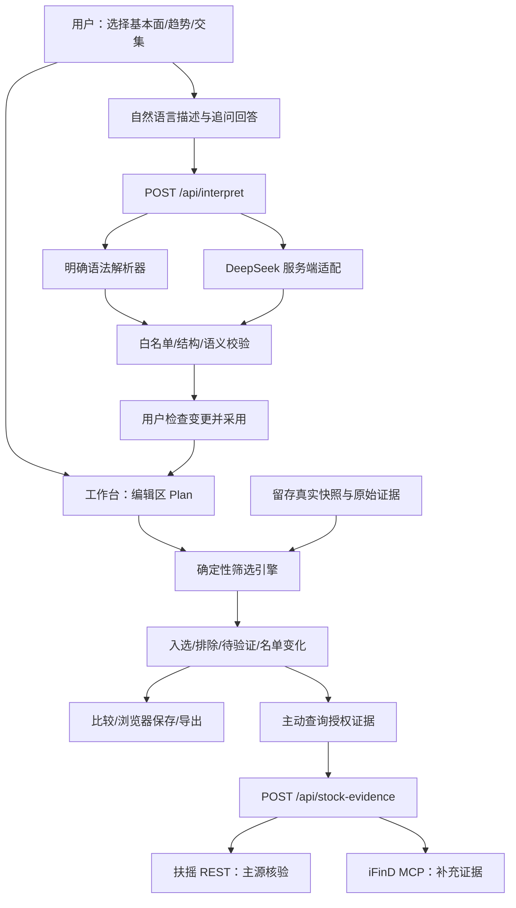

# 架构与职责

## 模块边界

| 模块 | 责任 | 不负责 |
|---|---|---|
| `app/page.tsx` | 页面状态、草稿与已执行规则分离、用户确认 | 调用带密钥的外部服务 |
| `components/StockChart.tsx` | 留存真实行情图 | 预测或下单价格 |
| `components/ProviderEvidence.tsx` | 配置状态和授权证据查询/导出 | 将未核验文本映射为数值 |
| `lib/intent.ts` | 明确语法、增量修改、多轮选择/范围、计划结构校验 | 通用语言模型推理 |
| `app/api/interpret/route.ts` | DeepSeek适配、上下文和输出校验、超时/错误处理 | 生成股票数据或名单 |
| `lib/screener.ts` | 指标字典、AND执行、冲突/重复/取舍、三态解释、差异 | 隐藏评分或自动放宽条件 |
| `lib/providers/fuyao.ts` | 固定官方端点、代码消歧、业务code、重试、证据回执 | 把空值补0或伪造权限 |
| `lib/providers/ifind.ts` | MCP握手、会话头、JSON/SSE响应、工具失败检测 | 猜测响应字段口径 |
| `app/api/stock-evidence/route.ts` | 样本白名单、固定查询、服务端认证、脱敏错误 | 通用付费API代理 |
| `scripts/enrich-trends.py` | 可重现技术指标计算 | 改写原始行情 |
| `scripts/verify-connections.ts` | 最小真实连接验证和脱敏状态报告 | 用mock冒充线上可用 |

## 当前数据流与计划切源的界限

筛选仍使用明确标注的公开留存快照。扶摇/iFinD的授权查询路径已实现，但本轮网络阻断，尚无成功响应可用于字段映射和批量替换。页面授权证据查询和筛选数据更新是两个不同动作：查询成功不等于静默切换整套快照。

扶摇成为筛选主源的验收条件：核验真实代码、复权、日线窗口、财报披露日、财务字段含义和覆盖率；构建独立版本；按同一规则对比旧源差异；原子切换并显示每字段来源。不把最新估值时间戳假装成历史估值日期，不把净利润增速当作归母净利润增速。未满足条件前不宣称主源切换完成。

iFinD补充原始证据，只有字段/期次/单位已核验才进入数值条件；不以模型自行抽取的无依据数字参与筛选。

## 凭证与数据

生产凭证在Sites服务端秘密配置中；本地凭证在仓库之外的0600文件，运行时注入环境。源码只保留变量名称与非敏感示例。`work/`记录取数证据且被Git忽略。官方授权原始数据不自动进入公开仓库。

当前未实现持久配额/分布式限流；页面仍为私有展示。公开评审访问前应控制模型与金融接口调用额度，或限制授权查询入口。公开访问尚未开启，不将当前私有链接标作可交付的公开URL。
