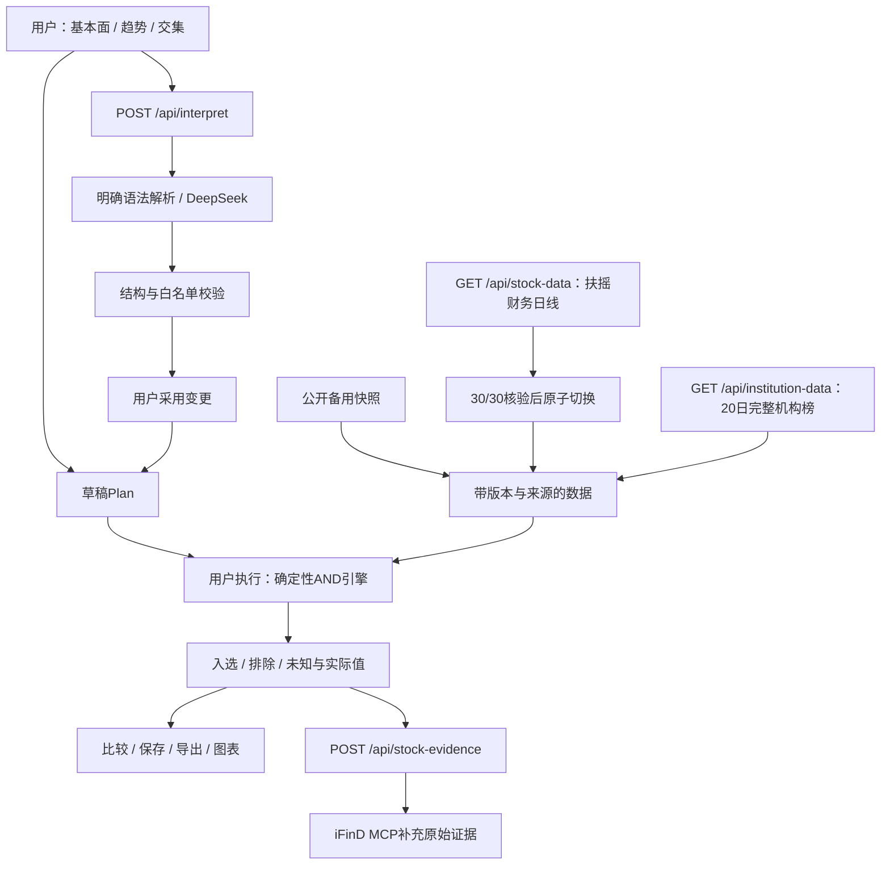

# 架构与职责

| 模块 | 责任 |
| --- | --- |
| `app/page.tsx` | 两套独立草稿/执行计划、确认、视图、原子切源与进度 |
| `lib/intent.ts` | 明确语法、澄清续答、增量修改、完整Plan校验 |
| `app/api/interpret/route.ts` | 真实DeepSeek、最近8条历史、严格输出协议、45秒超时和脱敏错误 |
| `lib/screener.ts` | 指标字典、AND三态、冲突/重复/取舍、名单差异 |
| `lib/market-data.ts` | 扶摇利润表和日线标准化、字段时点验证、技术指标计算、每指标来源 |
| `lib/institution.ts` | 20日完整覆盖检查、当日榜去重、缺少分母保持未知 |
| `lib/providers/fuyao.ts` | REST认证、代码消歧、业务code、有限重试和回执 |
| `lib/providers/ifind.ts` | MCP握手、会话头、JSON/SSE、工具失败处理 |
| `app/api/stock-data/route.ts` | 固定30只白名单、1小时进程缓存、并发请求合并 |
| `app/api/institution-data/route.ts` | 固定20日查询、逐日验证、完整响应后启用、进程缓存 |
| `app/api/stock-evidence/route.ts` | 固定样本/固定查询，非任意付费API代理 |
| `components/StockChart.tsx` | 60日收盘、MA20/60及量能图 |
| `components/ProviderEvidence.tsx` | 配置标志、授权补充查询和回执导出 |

模型不直接生成数值、选股名单或执行SQL。用户采用方案只改草稿，执行才变更名单。零结果不放宽；任一明确失败可排除，但未知项仍保留解释。

主源切换不替换历史估值：扶摇最新估值接口没有承诺每字段对应指定历史日，因此保留东方财富同日值并标注。财务营收采用扶摇营业收入口径，备用为营业总收入，定义里明确区分。iFinD文本保留为补充证据，不将模型抽取值未经核验投入筛选。

所有外部密钥在服务端；本地0600文件在仓库外，生产用Sites秘密变量。Vite仅在serve阶段注入允许变量，build不带值。授权原始数据运行时提供给授权访问者，不进入公开仓库。`work/`为被忽略的实测回执目录。

当前站点保留所有者访问。缓存不是分布式限流，公开评审前需控制调用额度或评审访问范围。刷新后重新选择授权主源，避免浏览器持久化授权原始数据。

## v4 增量

- `lib/universe.ts`：题材字典、别名、业务依据；`public/data/universe.json`是可下载映射。题材并集与行业交集由确定性引擎执行。
- `lib/indicators.ts`：共享纯函数计算MA5/10/20上穿、位置、方向和Wilder ATR/RSI。公开快照构建与扶摇运行时使用同一实现，避免双份公式漂移。
- `scripts/enrich-v4.ts`：从留存完整日线和财务原始证据生成新指标；新增扣非质量字段保持东方财富来源，扶摇切源不能覆盖其来源声明。
- `components/RuleEditor.tsx`：指标分组、上下限合并、指标搜索，与执行引擎分离。
- `interpretIntent`：组合子句按一个事务处理。澄清选项带回整组未完成需求，避免丢失前文；`scopeSemanticsError`拦截模型题材OR被变成行业AND的错误。仍非通用语义形式证明。
